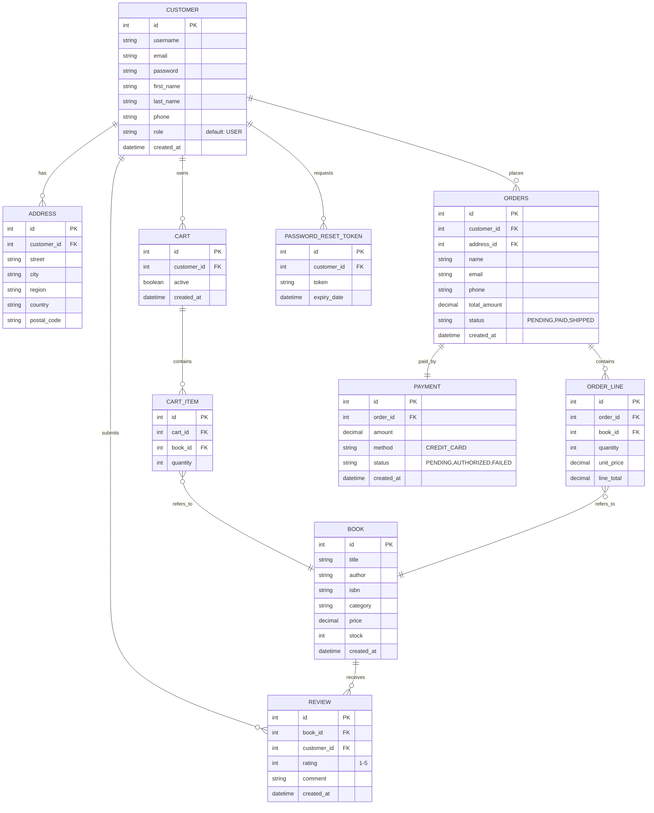

# 📚 Online Bookstore  
_Group 25 – SYSC 4806 F2025_  
A simple online store that allows individuals to purchase books from a bookstore owner.

  
  
  


_`README.md` Author(s)_: [@fareenlavji](https://github.com/fareenlavji), [@MartinS416](https://github.com/MartinS416), [@JamesTucker](https://github.com/shapidobob).

---

# ✅ Table of Contents  
1. [Description](#description)
2. [Features](#features)  
3. [Architecture & Schema](#architecture--schema)  
   3.1. [System Architecture (Package-Based MVC)](#31-system-architecture-package-based-mvc)  
   3.2. [Database Schema (ER Diagram)](#32-database-schema-er-diagram)  
   3.3. [Component Interaction Diagram (High-Level)](#33-component-interaction-diagram-high-level)  
   3.4. [Test Architecture](#34-test-architecture)  
4. [Tech Stack](#tech-stack)  
5. [Getting Started](#getting-started)  
   5.1. [Prerequisites](#51-prerequisites)  
   5.2. [Installation](#52-installation)  
   5.3. [Running the Application](#53-running-the-application)  
6. [Database Setup](#database-setup)  
   6.1. [Development (H2 In-Memory)](#61-development-h2-in-memory)  
   6.2. [Production (MySQL or Azure SQL)](#62-production-mysql-or-azure-sql)  
7. [Usage](#usage)  
   7.1. [Books](#71-books)  
   7.2. [Cart & Orders](#72-cart--orders)  
   7.3. [Admin](#73-admin)  
8. [API Endpoints](#api-endpoints)  
9. [Project Structure](#project-structure)  
   9.1. [Test Coverage](#91-test-coverage)  
   9.2. [Running Tests](#92-running-tests)  
   9.3. [Key Testing Documents](#93-key-testing-documents)  
10. [Contributions by Milestone](#contributions-by-milestone)  

---

## 1. 📖 Description
This project implements an **online bookstore** with two distinct user roles:
- **Customer**: Can browse books, add them to a cart, and complete purchases
- **Admin**: Can manage books, view orders, and access dashboard analytics

Built with **Spring Boot 3.3**, **Thymeleaf**, and **H2 Database** (with Azure cloud hosting available).

---

## 2. ✨ Features
- ✅ User authentication and role-based access control (RBAC)
- ✅ CRUD operations for books with inventory management
- ✅ Shopping cart and checkout functionality
- ✅ Order management and order history
- ✅ Product reviews and ratings (1-5 stars)
- ✅ Admin dashboard with analytics and reporting
- ✅ Responsive UI using Thymeleaf templates
- ✅ In-memory H2 database for development
- ✅ Comprehensive test suite (26+ test classes)
- ✅ Cloud hosting on Azure

---

## 3. 🏗 Architecture & Schema

### 3.1. System Architecture (Package-Based MVC)

The application follows a **package-first architecture** organized by domain, with each package containing its own MVC layers:

```
src/main/java/com/bookstore/
├── security/           # Authentication & Authorization
│   ├── model/          # User, Role entities
│   ├── service/        # LoginService, PasswordValidator
│   ├── repository/     # UserRepository
│   ├── controller/     # LoginController, ProfileController
│   └── config/         # SecurityConfiguration
├── inventory/          # Book Catalog & Stock Management
│   ├── model/          # Book, Merchant, Shop entities
│   ├── service/        # BookService, SearchService
│   ├── repository/     # BookRepository
│   ├── controller/     # ShopController, AdminBookController
├── pos/                # Point-of-Sale (Cart, Orders, Payments)
│   ├── model/          # Cart, Order, OrderLine, Review, Payment entities
│   ├── service/        # CartService, OrderService, PaymentService, ReviewService
│   ├── repository/     # OrderRepository, CartRepository
│   └── controller/     # CartController, CheckoutController
└── common/             # Shared Components
    ├── model/          # Customer, Address entities
    ├── exception/      # ResourceNotFoundException, GlobalExceptionHandler
    ├── dto/            # Data Transfer Objects (CustomerDTO, OrderDTO)
    ├── service/        # CustomerService, AddressService
    ├── repository/     # CustomerRepository, AddressRepository
    └── controller/     # CustomerController, ProfileController
```

### 3.2. Database Schema (ER Diagram)



**View full Data Design**: [Data-Design-(Normalized-Schema-3NF-Form)](https://github.com/MartinS416/SYSC4806_group_25_online_book_store/wiki/Data-Design-(Normalized-Schema-%E2%80%90-3NF-Form))

### 3.3. Component Interaction Diagram (High-Level)

```
┌─────────────┐
│  UI Layer   │  (Thymeleaf Templates)
│  (MVC View) │  shop.html, cart.html, login.html, admin dashboard
└──────┬──────┘
       │
┌──────▼──────────────────────────────────────┐
│        Spring Web Layer (Controllers)        │
│  ShopController, CartController, AdminCtl... │
└──────┬──────────────────────────────────────┘
       │
┌──────▼──────────────────────────────────────┐
│      Service Layer (Business Logic)          │
│  CartService, OrderService, BookService...   │
└──────┬──────────────────────────────────────┘
       │
┌──────▼──────────────────────────────────────┐
│     Repository Layer (Data Access)           │
│  JpaRepository implementations via H2/MySQL  │
└──────┬──────────────────────────────────────┘
       │
┌──────▼──────────────────────────────────────┐
│      Database Layer (H2 / Azure SQL)         │
│  Normalized 3NF schema with 12+ tables       │
└─────────────────────────────────────────────┘
```

### 3.4. Test Architecture

The project implements **26+ test classes** across three test levels per ISO/IEC/IEEE 29119-3:2021:

```
Test Pyramid (34 automated tests)
       ▲
       │       System Tests (4 tests)
       │      ┌─────────────┐
       │      │ E2E Flows   │ (Spring Integration + MockMvc)
       │      └─────────────┘
       │    ┌─────────────────────┐
       │    │ Integration Tests   │ (13 tests)
       │    │ Service-Repository  │ (Spring Test + H2)
       │    └─────────────────────┘
       │  ┌───────────────────────────┐
       │  │ Unit Tests (19 tests)     │
       │  │ Mocked (Mockito) classes  │
       │  └───────────────────────────┘
       └─────────────────────────────────

Test Classes by Package:
├── security/: SecurityConfigurationTest, LoginTest
├── inventory/: BookTest, BookServiceTest, ShopControllerTest
├── pos/: CartServiceTest, OrderServiceTest, PaymentServiceTest, ReviewServiceTest
└── common/: CustomerTest, AddressTest, LoginServiceTest, etc.
```

**See**: [Test Design Specification (TDS) v3.2](https://github.com/MartinS416/SYSC4806_group_25_online_book_store/wiki/Test-Design-Specification-(TDS))  
**See**: [V&V Plan v3.2](https://github.com/MartinS416/SYSC4806_group_25_online_book_store/wiki/Verification-and-Validation-(V&V)-Plan)

---

## 4. 🛠 Tech Stack

| Component | Technology | Version |
|-----------|-----------|---------|
| **Language** | Java | 21 (LTS) |
| **Framework** | Spring Boot | 3.3.x |
| **ORM** | JPA/Hibernate | Spring Data JPA |
| **Web** | Spring Web MVC | 3.3.x |
| **Security** | Spring Security | 6.x |
| **Template Engine** | Thymeleaf | 3.1.x |
| **Database** | H2 (dev) / MySQL (prod) | H2 2.x / MySQL 8.0 |
| **Build Tool** | Maven | 3.9+ |
| **Test Framework** | JUnit 5 (Jupiter) | 5.9+ |
| **Mocking** | Mockito | 5.3+ |
| **Assertions** | AssertJ | 3.24+ |
| **Coverage** | JaCoCo | 0.8.10+ |
| **Cloud** | Microsoft Azure | SQL Database + App Service |

---

## 5. 🚀 Getting Started

### 5.1. Prerequisites
- **Java 21 SDK** ([Download](https://www.oracle.com/java/technologies/javase/jdk21-archive-downloads.html))
- **Maven 3.9+** ([Download](https://maven.apache.org/download.cgi))
- Git installed

### 5.2. Installation
```bash
# Clone the repository
git clone https://github.com/MartinS416/SYSC4806_group_25_online_book_store.git

# Navigate to project directory
cd SYSC4806_group_25_online_book_store

# Build the project
mvn clean install
```

### 5.3. Running the Application
```bash
# Start the Spring Boot application
mvn spring-boot:run

# Application runs on:
# http://localhost:8080
```

**Access the app**:
- **Shop**: `http://localhost:8080/shop`
- **Cart**: `http://localhost:8080/cart` (requires login)
- **Admin Dashboard**: `http://localhost:8080/admin/dashboard` (requires ADMIN role)

---

## 6. 🗄 Database Setup

### 6.1. Development (H2 In-Memory)
By default, the application uses **H2 in-memory database**:
```properties
# application.properties
spring.datasource.url=jdbc:h2:mem:bookstoredb
spring.datasource.driverClassName=org.h2.Driver
spring.h2.console.enabled=true
spring.jpa.database-platform=org.hibernate.dialect.H2Dialect
```

Access H2 Console: `http://localhost:8080/h2-console`

### 6.2. Production (MySQL or Azure SQL)
Update `application-prod.properties`:
```properties
spring.datasource.url=jdbc:mysql://localhost:3306/bookstore
spring.datasource.username=root
spring.datasource.password=yourpassword
spring.jpa.hibernate.ddl-auto=validate
spring.jpa.database-platform=org.hibernate.dialect.MySQL8Dialect
```

---

## 7. 🔗 API Endpoints

### 7.1. Books
| Method | Endpoint | Description | Auth |
|--------|----------|-------------|------|
| GET | `/shop` | List all books with filters | None |
| GET | `/shop?search=...` | Search books by title/author | None |
| GET | `/books/{id}` | Get book details | None |
| POST | `/admin/books` | Create new book | ADMIN |
| PUT | `/admin/books/{id}` | Update book | ADMIN |
| DELETE | `/admin/books/{id}` | Delete book | ADMIN |

### 7.2. Cart & Orders
| Method | Endpoint | Description | Auth |
|--------|----------|-------------|------|
| GET | `/cart` | View cart items | USER |
| POST | `/cart/add/{bookId}` | Add book to cart | USER |
| POST | `/cart/remove/{itemId}` | Remove from cart | USER |
| POST | `/checkout` | Create order from cart | USER |
| GET | `/orders` | View order history | USER |

### 7.3. Admin
| Method | Endpoint | Description | Auth |
|--------|----------|-------------|------|
| GET | `/admin/dashboard` | View analytics & reports | ADMIN |
| GET | `/admin/customers` | List customers | ADMIN |
| GET | `/admin/orders` | View all orders | ADMIN |

---

## 8. 🧩 Project Structure

```
SYSC4806_group_25_online_book_store/
├── src/
│   ├── main/
│   │   ├── java/com/bookstore/        # Application source code
│   │   │   ├── security/              # Auth & RBAC
│   │   │   ├── inventory/             # Books & Search
│   │   │   ├── pos/                   # Cart & Orders
│   │   │   └── common/                # Shared components
│   │   ├── resources/
│   │   │   ├── templates/             # Thymeleaf templates
│   │   │   ├── static/                # CSS, JS, images
│   │   │   └── application.properties # Configuration
│   └── test/
│       └── java/com/bookstore/        # Test classes (26+ tests)
├── pom.xml                            # Maven dependencies
├── README.md                          # This file
└── wiki/                              # GitHub Wiki pages
    ├── Test-Design-Specification
    ├── Verification-&-Validation-Plan
    └── Data-Design
```

---

## 9. ✅ Testing & Quality Assurance

This project follows **ISO/IEC/IEEE 29119-3:2021** testing standards with comprehensive V&V documentation.

### 9.1. Test Coverage

| Package | Unit Tests | Integration Tests | Coverage Target |
|---------|------------|-------------------|-----------------|
| `security/` | 1 | 4 | ≥ 80% |
| `inventory/` | 5 | 2 | ≥ 80% |
| `pos/` | 4 | 1 | ≥ 80% |
| `common/` | 9 | 4 | ≥ 80% |
| **Total** | **19** | **13** | **≥ 70%** |

### 9.2. Running Tests

```bash
# All tests
mvn clean test

# Unit tests only
mvn test -Dtest="*Test"

# Integration tests
mvn clean verify -Dtest="*IT"

# With coverage report
mvn clean verify jacoco:report
# View: target/site/jacoco/index.html

# Package-specific tests
mvn test -Dtest="com.bookstore.security.**Test"
mvn test -Dtest="com.bookstore.inventory.**Test"
mvn test -Dtest="com.bookstore.pos.**Test"
```

### 9.3. Key Testing Documents
#### 9.3.1. Test Design Specification (TDS) v4.1
   - 36 test cases across 4 packages
   - Test design techniques: EP, BVA, State Transitions, Decision Tables
   - [View TDS](https://github.com/MartinS416/SYSC4806_group_25_online_book_store/wiki/Test-Design-Specification-(TDS))

#### 9.3.2. Verification & Validation (V&V) Plan v3.2
   - IEEE 1012-2024 & ISTQB CTFL v4.0 compliance
   - Traceability matrix (28 requirements → 36 tests)
   - Defect management process
   - [View V&V Plan](https://github.com/MartinS416/SYSC4806_group_25_online_book_store/wiki/Verification-and-Validation-(V&V)-Plan)

#### 9.3.3. Test Strategy & Plan v3.2
   - Entry/exit criteria by test level
   - Risk mitigation strategies
   - [View Test Strategy](https://github.com/MartinS416/SYSC4806_group_25_online_book_store/wiki/Software-Test-Plan-(STP))

---

## 10. 📌 Contribution Summary by Milestone

| User | Milestone 01 | Milestone 02 | Milestone 03 |
|------|--------------|--------------|--------------|
| [@fareenlavji](https://github.com/fareenlavji) | 1. Integrated and refined initial ER schema.<br>2. Programmed entities (models), and repositories. | 1. Programmed controllers and systems.<br>2. Refactored models and package layout.<br>3. Added partial suite of unit tests. | 1. Refined DDL to be 3NF compliant.<br>2. Refined architecture into business domain silos of MVCs and their associated test suites, categorized into unit, integration, and system tests.<br>3. Fixed bugs for Order `totalAmount` calculations and persistence along with othe minor fixes and git merge fixes.<br>4. Updated repo wikis. | 
| [@martins416](https://github.com/martins416)   | 1. Implemented basic payment processing.<br>2. Implemented website styling and layout.<br>3. Set up Azure hosting and CI/CD pipeline. | 1. Implemented login authentication system.<br>2. Created and configured the database schema.<br>3. Additional backend setup tasks. | 1. Implemented full admin pages and management tools.<br>2. Fixed UI-related bugs across the site.<br>3. Improved overall interface stability. |
| [@JamesTucker](https://github.com/shapidobob)  | 1. Added error handling to checkout.<br>2. Created first itteration of Readme.<br>3. Bug fixes, Edits, and PR reviews. | 1. Credit card validation.<br>2. Checkout logic.<br>3. Fixed Bugs in card. | 1. Ensured removal of purchaced books.<br>2. Added inactive cart system.<br>3. Added more error handling and purchace success screen to cart. |
| [@YousifMuziel](https://github.com/YousifMuziel) | 1. Implemented the Shopping Cart feature, including add/remove item logic and quantity updates.<br>2. Developed the Cart Page UI and integrated it with backend services.<br>3. Created the initial suite of unit tests for cart operations and ensured core functionality stability. | 1. Added full filter functionality to the Shop page (category, price range, and stock availability).<br>2. Implemented backend filtering logic and updated controllers/services accordingly.<br>3. Resolved UI/UX issues on the Shop and Cart pages to improve user flow and consistency. | 1. Developed the book recommendation system and integrated it with the Shop page.<br>2. Improved filter performance and refined query handling to prevent logical issues (e.g., min/max edge cases).<br>3. Assisted with final debugging, polishing interfaces, and ensuring smooth milestone delivery. |
| [@Yuvi-Pain](https://github.com/Yuvi-Pain) | Create page to view Books. | Create search functionality to see books while customers perform search queries. | 1. Implemented Reviews UI on Book-Details page.<br>2. UI improvements. |

<!--
---

## 📜 License
This project is licensed under the MIT License. See [LICENSE](LICENSE) for details.
-->
