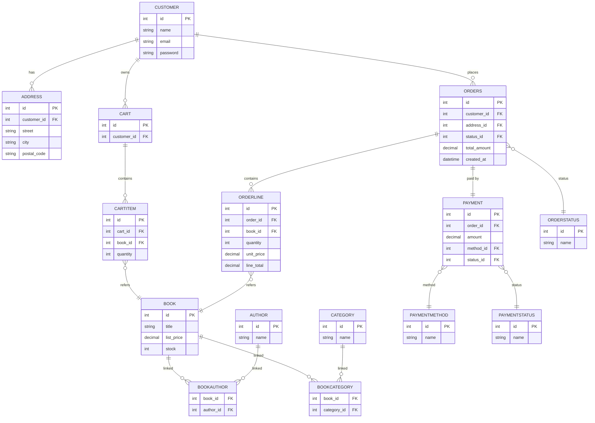

# 📚 Online Bookstore  
_Group 25 – SYSC 4806 F2025_  
A simple online store that allows individuals to purchase books from a bookstore owner.

  
  
  


**Author[s]**: [@fareenlavji](https://github.com/fareenlavji), [@JamesTucker](https://github.com/shapidobob), etc.

---

## ✅ Table of Contents
- [Description](#description)
- [Features](#features)
- [Architecture & Schema](#architecture--schema)
- [Tech Stack](#tech-stack)
- [Getting Started](#getting-started)
- [Database Setup](#database-setup)
- [Usage](#usage)
- [API Endpoints](#api-endpoints)
- [Project Structure](#project-structure)
- [Contributions by Milestone](#contributions-by-milestone)
- [License](#license)
- [Contact](#contact)

---

## 📖 Description
This project implements an **online bookstore** with two distinct user roles:
- **Merchant**: Can add books and modify details such as Author, Publisher, Price, and other metadata.
- **Customer**: Can browse books, add them to a cart, and complete purchases.

---

## ✨ Features
- User authentication and role-based access.
- CRUD operations for books.
- Shopping cart and checkout functionality.
- Responsive UI using Thymeleaf templates.
- In-memory database for development (H2).
- DB hosted on Azure

---

## 🏗 Architecture & Schema
## Database (DB) Schema


_View full Data Design [here](https://github.com/MartinS416/SYSC4806_group_25_online_book_store/wiki/Data-Design-(Normalized-Schema-%E2%80%90-3NF-Form))._

---

## 🛠 Tech Stack
- **Backend**: Java 21, Spring Boot
- **Frontend**: Thymeleaf
- **Database**: H2 (development), R2DBC, can be extended to MySQL/PostgreSQL
- **Build Tool**: Maven or Gradle

---

## 🚀 Getting Started

### Prerequisites
- **Java 21 SDK**
- **Maven** (or Gradle)
- Git installed

### Installation
```bash
# Clone the repository
git clone https://github.com/<your-org>/SYSC4806_group_25_online_book_store.git

# Navigate to project directory
cd SYSC4806_group_25_online_book_store

# Build the project
mvn clean install
```

### Running the Application
```bash
# Start the Spring Boot application
mvn spring-boot:run
```
Access the app at: `http://localhost:8080`

---

## 🗄 Database Setup
By default, the application uses **H2 in-memory database** for development.  
To switch to **MySQL/PostgreSQL**:
1. Update `application.properties`:
```properties
spring.datasource.url=jdbc:mysql://localhost:3306/bookstore
spring.datasource.username=root
spring.datasource.password=yourpassword
spring.jpa.hibernate.ddl-auto=update
```
2. Ensure the database is running and accessible.
3. Run migrations if needed.

---

## 🔗 API Endpoints

### **Books**
| Method | Endpoint         | Description           |
|--------|------------------|-----------------------|
| GET    | `/books`         | List all books       |
| GET    | `/books/{id}`    | Get book by ID       |
| POST   | `/books`         | Add a new book       |
| PUT    | `/books/{id}`    | Update book details  |
| DELETE | `/books/{id}`    | Remove a book        |

### **Cart**
| Method | Endpoint         | Description           |
|--------|------------------|-----------------------|
| GET    | `/cart`          | View cart items      |
| POST   | `/cart/add/{id}` | Add book to cart     |
| DELETE | `/cart/remove/{id}` | Remove book from cart |

---

## 🧩 Project Structure
```
SYSC4806_group_25_online_book_store/
├── src/
│   ├── main/
│   │   ├── java/        # Application source code
│   │   ├── resources/   # Templates, static files, application.properties
│   └── test/            # Unit and integration tests
├── pom.xml              # Maven configuration
└── README.md
```
### Recommended Structure
```
<!--> package <-> MVC structure>
src/main/java/com/bookstore/
├── security/
│   ├── controller/
│   ├── service/
│   ├── repository/
│   ├── model/
│   └── config/
├── pos/
│   ├── controller/
│   ├── service/
│   ├── repository/
│   ├── model/
├── inventory/
│   ├── controller/
│   ├── service/
│   ├── repository/
│   ├── model/
└── common/
    ├── exception/
    ├── dto/
    ├── util/

<!--> test suite structure>
src/test/java/com/bookstore/
├── security/
├── pos/
├── inventory/
└── common/
```

---

## 📌 Contribution Summary by Milestone

| User                                           | Milestone 01                                                                                                                          | Milestone 02                                                            | Milestone 03                                                                                                                              |
|------------------------------------------------|---------------------------------------------------------------------------------------------------------------------------------------|-------------------------------------------------------------------------|-------------------------------------------------------------------------------------------------------------------------------------------|
| [@fareenlavji](https://github.com/fareenlavji) | Programmed entities (models), and repositories.                                                                                       | 1. Programmed controllers and systems.<br>2. Refactored models and package layout.<br>3. Added partial suite of unit tests. | 1. Refined DDL to be 3NF compliant.<br>2. Item 2<br>3. Item 3                                                                             | 
| [@martins416](https://github.com/martins416)   | 1. Implemented basic payment processing.<br>2. Implemented website styling and layout.<br>3. Set up Azure hosting and CI/CD pipeline. | 1. Implemented login authentication system.<br>2. Created and configured the database schema.<br>3. Additional backend setup tasks. | 1. Implemented full admin pages and management tools.<br>2. Fixed UI-related bugs across the site.<br>3. Improved overall interface stability. |
| [@JamesTucker](https://github.com/shapidobob)  | 1. Added error handling to checkout<br>2. Created first itteration of Readme<br>3. Bug fixes, Edits, and PR reviews                   | 1. Credit card validation<br>2. Checkout logic<br>3. Fixed Bugs in card | 1. Ensured removal of purchaced books<br>2. Added inactive cart system<br>3. Added more error handling and purchace success screen to cart|
| [@user4](https://github.com/user4)             | 1. Item 1<br>2. Item 2<br>3. Item 3                                                                                                   | 1. Item 1<br>2. Item 2<br>3. Item 3                                     | 1. Item 1<br>2. Item 2<br>3. Item 3                                                                                                       |
| [@user5](https://github.com/user5)             | 1. Item 1<br>2. Item 2<br>3. Item 3                                                                                                   | 1. Item 1<br>2. Item 2<br>3. Item 3                                     | 1. Item 1<br>2. Item 2<br>3. Item 3                                                                                                       |

<!--
---

## 📜 License
This project is licensed under the MIT License. See [LICENSE](LICENSE) for details.
-->
