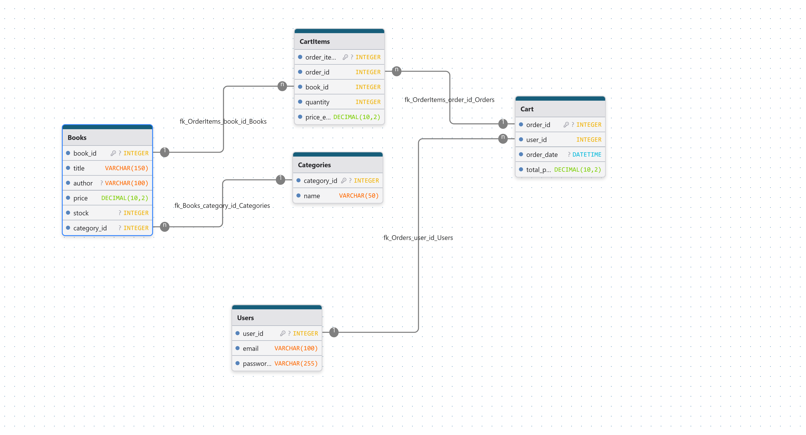

# Group 25 online bookstore

a simple online store that allows individuals to purchase books from a bookstore owner

## Description

there are two distinct users of this service:

- the bookstore owner is able to add books and modify their information such as Author, Publisher,
    or any other relevant information

- the bookstore customer is able to add books to their cart and purchase them

## Schema

## Getting Started

Clone repo and ensure you are running java 21 sdk

### Dependencies

* Springboot
* Thymeleaf
* H2database

### Installing

* no download is necessary

### Executing program

* go to [add azure link her]
* alternatively run OnlineBookStoreApplication then go to localhost

## Help

[help for any common issues will be added here as those issues are discovered]

## Authors

Bains, Yuvraj
Lavji, Fareen
Muziel, Yousif
Skachkov, Martin
Tucker, James

## Version History
